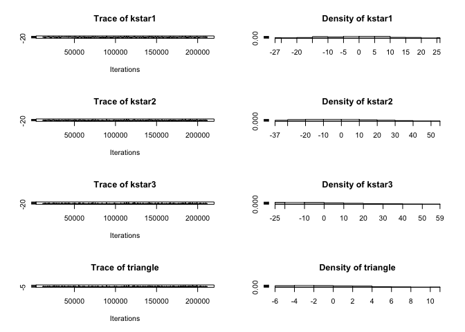
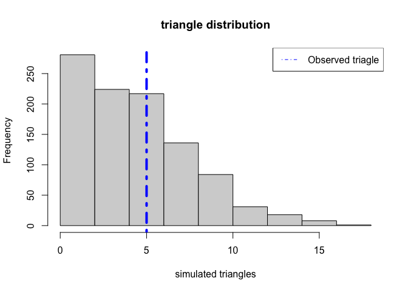
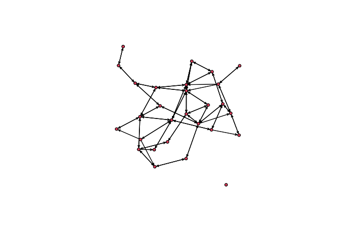
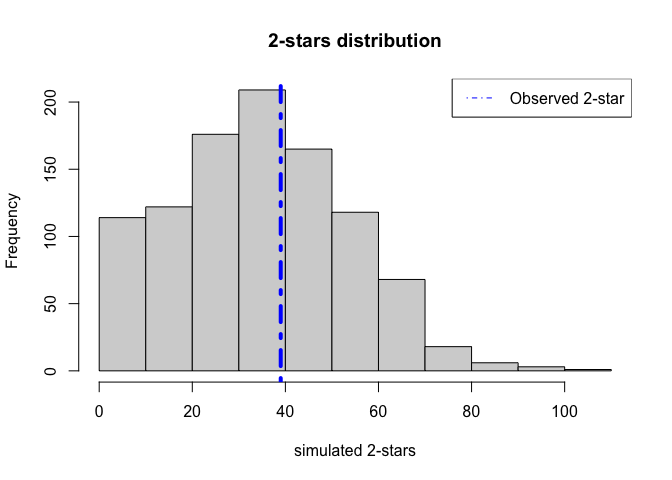
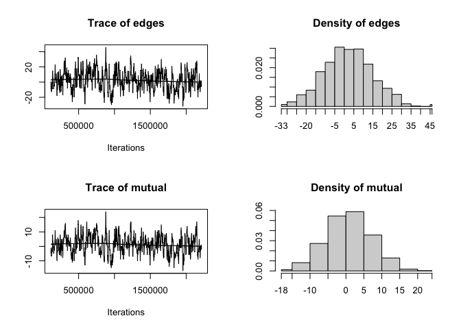

# Introducción a los Modelos Exponenciales de Grafos Aleatorios

El siguiente guión (*script*) corresponde al Workshop **Introducción a
los Modelos Exponenciales de Grafos Aleatorios** impartido en la 2nda
Conferencia Chilena de Redes Sociales
([ChiSocNet](https://www.chisocnet.org)) y realizado en Santiago de
Chile por [Alejandro Espinosa-Rada](https://www.aespinosarada.com)
([Instituto de Sociología](https://sociologia.uc.cl), Pontificia
Universidad Católica de Chile, Chile).

Antes de partir el tutorial, por favor instalar y abrir los siguientes
paquetes de `R` (todos ellos parte de la iniciativa
[statnet](https://github.com/statnet)):

``` r
par(mfrow=c(1,1))
# install.packages("network")
# install.packages("sna")
# install.packages("ergm")
library(network)
library(sna)
library(ergm)
```

# Ejemplo 1

Para comenzar a explorar los *exponential random graph models* (ERGMs)
utilizaremos la base de datos de la familia florentina de [Padgett y
Ansell (1993)](https:/doi.org/10.1086/230190), puesto a disposición
originariamente por [Padgett
(1994)](http://home.uchicago.edu/jpadgett/papers/unpublished/maelite.pdf)
en [UCINET](http://www.analytictech.com/archive/ucinet.htm).

Datos son no direccionados y no valorados.

``` r
data("florentine")
```

Los datos que utilizaremos corresponden a los vínculos financieros
(préstamos, créditos y asociaciones conjuntas) entre las familias
renacentistas de Florencia. Además, los datos poseen un formato especial
que suele utilizar la iniciativa `statnet` y que corresponden a objetos
`networks`.

``` r
# ?florentine
flobusiness
```

    ##  Network attributes:
    ##   vertices = 16 
    ##   directed = FALSE 
    ##   hyper = FALSE 
    ##   loops = FALSE 
    ##   multiple = FALSE 
    ##   bipartite = FALSE 
    ##   total edges= 15 
    ##     missing edges= 0 
    ##     non-missing edges= 15 
    ## 
    ##  Vertex attribute names: 
    ##     priorates totalties vertex.names wealth 
    ## 
    ## No edge attributes

``` r
plot(flobusiness)
```

<!-- -->

## Modelo Bernoulli

El primer tipo de modelos que exploraremos son los denominados modelos
de Bernoulli, también conocidos como
[Erdos-Renyi](https://www.renyi.hu/~p_erdos/1959-11.pdf).

``` r
# Set equal to the network density of our observed graph.
bernoulli <- ergm(flobusiness ~ edges)
summary(bernoulli)

# GLM
edgelist <- flobusiness[upper.tri(flobusiness)]
glm_bernoulli <- glm(edgelist ~ 1, family = binomial(link="logit"))
summary(glm_bernoulli)
```

¿Cuál es la relación entre la densidad de una red y la probabilidad de
que exista un vínculo en este modelo?

``` r
# Density (observed networks/potential networks)
network.density(flobusiness)

# converting log-odds to probability
inv.logit <- function(logit){
  odds <- exp(logit)
  prob <- odds / (1 + odds)
  return(prob)
}
theta <- coef(bernoulli)
inv.logit(theta)
```

Considerando que


    ¿Es el logit invertido un buen indicador para modelos más complejos?

## Modelo que asume dependencia de Markov

A continuación, estimaremos un modelo que asume dependencia de Markov
([Frank & Strauss, 1986](https://doi.org/10.2307/2289017)).

``` r
set.seed(2021)
markov <- ergm(flobusiness ~ kstar(1:3) + triangle)
summary(markov)
```

¿Qué pasa si vuelve a estimar el modelo?

``` r
summary(ergm(flobusiness ~ kstar(1:3) + triangle))

markov$coefficients
```

¿Es la estimación suficientemente estable?

``` r
mcmc.diagnostics(markov)
```

<!-- -->

¿Qué pasa si simulamos $1.000$ veces una red considerando los parámetros
estimados con anterioridad?

``` r
set.seed(26111949) # A random seed... somehow related with T. Snijders?
simulation <- simulate(flobusiness ~ kstar(1:3) + triangle, 
                       coef=markov$coefficients, nsim = 1000, output='stats')

hist(simulation[,4], main="triangle distribution", 
     xlab="simulated triangles")
abline(v=markov$nw.stats[4], col = 'blue', lwd = 4, lty=4) # target statistics
legend(x = "topright", lty = c(4),
       col= c("blue"), 
       legend=c("Observed triagle"))
```

<!-- -->

``` r
# Convergence statistics
abs((mean(simulation[,4]-markov$nw.stats[4]))/sd(simulation[,4]))
```

# Ejemplo 2

El segundo ejemplo que utilizaremos es una red recolectada por Milan
Stuchlik (1976) sobre los mecanismos de reclutamiento social entre los
Mapuches en Chile, trabajo etnográfico documentado en el libro **“Life
on a Half Share”** y que es uno de estudios pioneros del análisis de
redes sociales en Chile.

``` r
# install.packages("devtools")
# library(devtools)
# devtools::install_github("anespinosa/classicnets")
library(classicnets)

par(mfrow = c(1, 1))
data("informalhelp_mapuche")
?informalhelp_mapuche
```

Datos: red direccionada y categórica, en donde solo utilizaremos el
valor *Ayuda informal: al menos una ayuda observada durante el trabajo
de campo*.

``` r
matrix <- informalhelp_mapuche$informalhelp
matrix[matrix!=3] <- 0
mapuche <- network(matrix)
```

## Modelo que asume independencia de relaciones diádicas

Antes de estimar el modelo, se realizará un análisis descriptivo
considerando la visualización de la red y un censo de díadas
([MAN](https://www.jstor.org/stable/2775735)). ¿Qué podemos apreciar de
la red?

``` r
plot(mapuche)
```

<!-- -->

``` r
dyad.census(mapuche) # descriptivo
```

Estimando el modelo….

``` r
dyadic <- ergm(mapuche ~ edges + mutual)
summary(dyadic)
```

¿Qué pasa si simulamos $1.000$ veces una red considerando los parámetros
estimados con anterioridad?

``` r
set.seed(11041952) # a random seed... somehow related with P. Pattison?
simulation2 <- simulate(mapuche ~ edges + mutual, coef = dyadic$coefficients,
                        nsim = 1000, output='stats')

hist(simulation[,2], main="2-stars distribution", 
     xlab="simulated 2-stars")
abline(v=dyadic$nw.stats[2], col = 'blue', lwd = 4, lty=4) # target statistics
legend(x = "topright", lty = c(4),
       col= c("blue"), 
       legend=c("Observed 2-star"))
```

<!-- -->

Otros diagnósticos:

``` r
mcmc.diagnostics(dyadic)
```

<!-- -->

``` r
dyadic.gof <- gof(dyadic)

par(mfrow = c(2, 3))
plot(dyadic.gof, main = '')
```

<!-- -->

    ¿Qué podemos decir de los gráficos observados?

## Modelo que asume circuito social

A continuación estimaremos el modelo incorporando `dgwesp` (i.e.,
*Directed Geometrically-Weighted Edgewise Shared Partnerships*). Este
efecto considera las siguientes variaciones:

- UTP - Undirected two-path (undirected graphs only)
- OTP - Outgoing two-path $(i \rightarrow k \rightarrow j)$
- ITP - Incoming two-path $(i \leftarrow k \leftarrow j)$
- RTP - Reciprocated two-path $(i \leftrightarrow k \leftrightarrow j)$
- OSP - Outgoing shared partner $(i \rightarrow k \leftarrow j)$
- ISP - Incoming shared partner $(i \leftarrow k \rightarrow j)$

``` r
?'ergm-terms'
social_circuit <- ergm(mapuche ~ edges + mutual 
                      + dgwesp(log(2), type = "OTP", fixed = TRUE)
                      )
summary(social_circuit)
```

Finalmente, realizaremos algunos diagnósticos para evaluar si hay
convergencia en el modelo y para identificar sus bondades de ajuste.

``` r
mcmc.diagnostics(social_circuit)
```

<!-- -->

``` r
social_circuit.gof <- gof(social_circuit)

par(mfrow = c(2, 3))
plot(social_circuit.gof, main = '')
```

<!-- -->

    ¿El modelo de circuito social muestra ajustes mejores que el modelo de independencia de relaciones diádicas? ¿Podemos mejorar el modelo?
